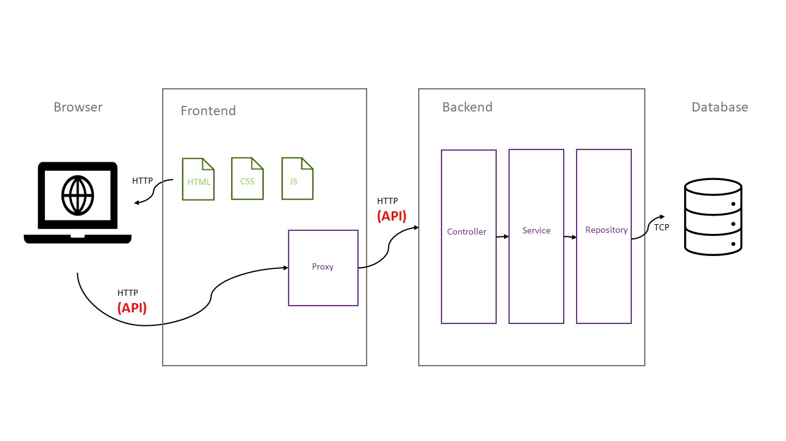

# Panoramica

L'obiettivo del progetto è realizzare una SPA (Single Page Application) per la gestione
di dottori, pazienti, visite di un ospedale. Il progetto è tratto da un progetto reale
di Intesys, ovvero Open Hospital.

## Architettura

L'architettura del software è mostrata nel seguente schema

## Preparazione

- Presentazione progetto
- Installazione software
    - java SDK https://github.com/adoptium/temurin17-binaries/releases/download/jdk-17.0.7%2B7/OpenJDK17U-jdk_x64_windows_hotspot_17.0.7_7.msi
    - intellij https://download.jetbrains.com/idea/ideaIC-2023.1.2.exe
    - maven https://dlcdn.apache.org/maven/maven-3/3.9.2/binaries/apache-maven-3.9.2-bin.zip
    - git https://github.com/git-for-windows/git/releases/download/v2.41.0.windows.1/Git-2.41.0-64-bit.exe
    - postman https://dl.pstmn.io/download/latest/win64
    - postgres https://sbp.enterprisedb.com/getfile.jsp?fileid=1258478
    - dbeaver https://dbeaver.io/files/dbeaver-ce-latest-x86_64-setup.exe
- Descrizione approccio api first (api.yml)

# Programma

## Giorno 1

- Importazione in postman dell'api
- Clone progetto github

                       git clone  https://github.com/ygmarchi/codylab-rookie.git -b <nome>

- Creazione progetto intellij
- Class main
- Importazione spring boot
- Controller creazione doctor
- Servizio creazione doctor
- Inizializzazione db tramite flyway
- Repository creazione doctor
- Test postman